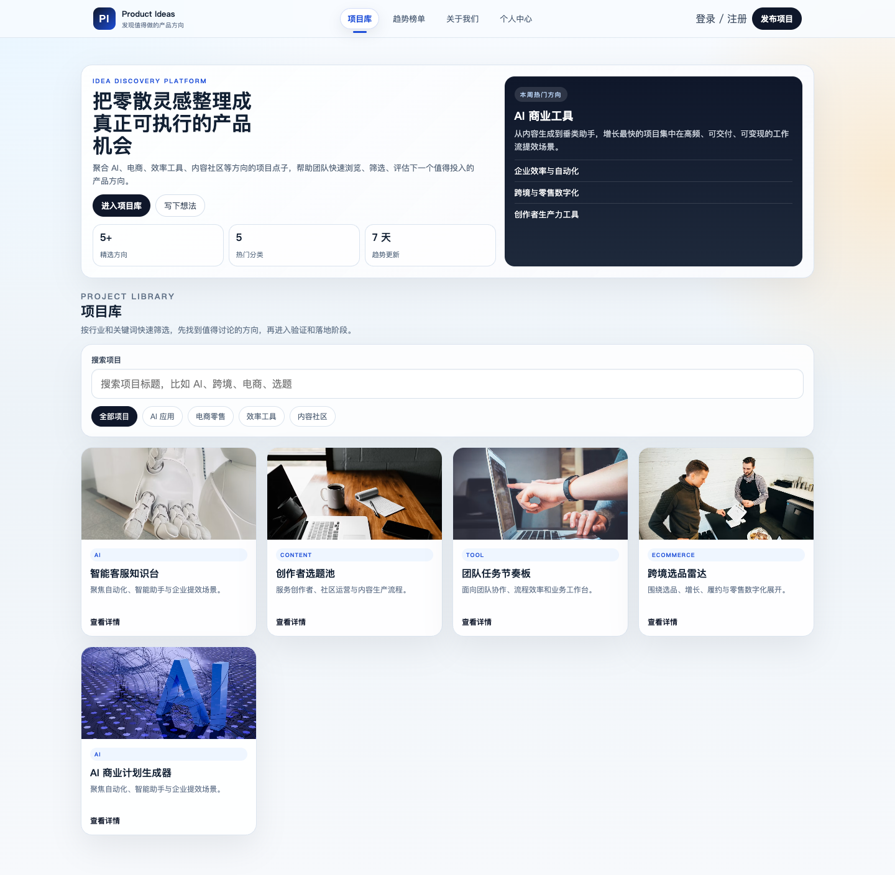
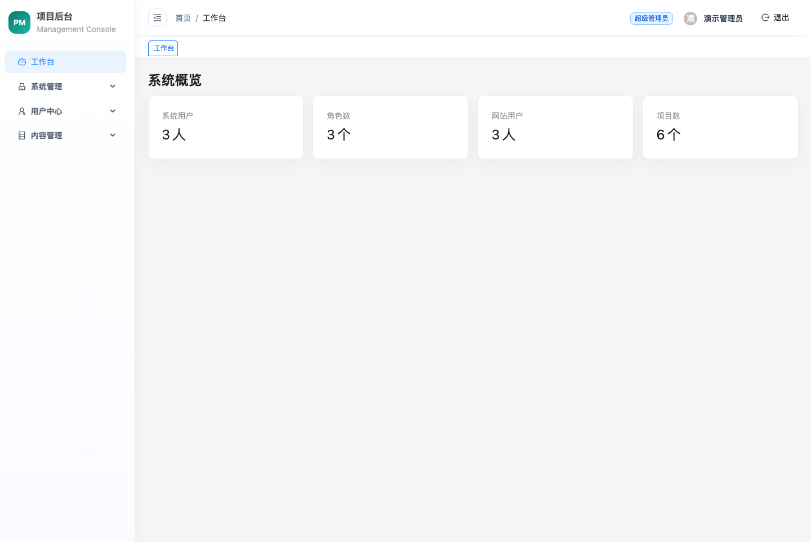
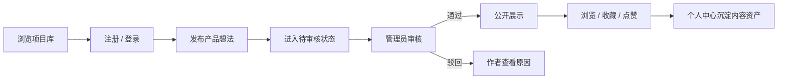
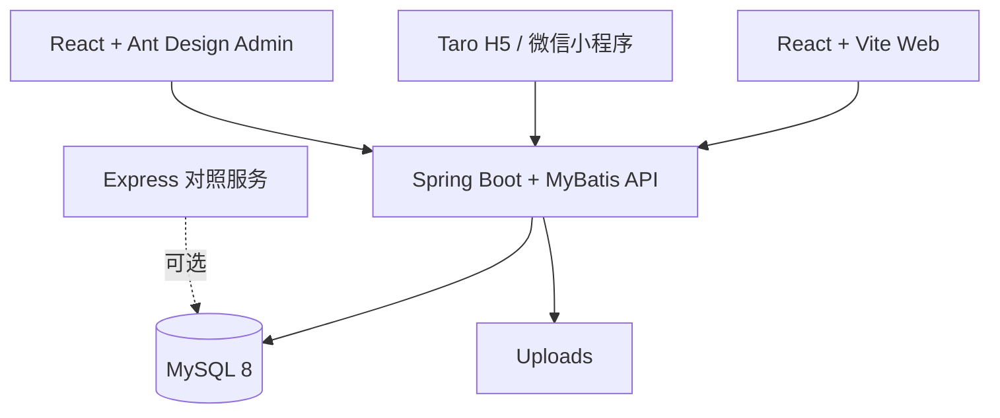

# IdeaHub — Product Ideas Community Starter

面向独立开发者、产品经理和创业者的产品灵感社区全栈 Starter。

一套仓库同时包含 React Web、Taro H5 / 微信小程序、Ant Design 管理后台，以及 Spring Boot + MyBatis API，完整覆盖“发现项目 → 用户投稿 → 后台审核 → 公开展示 → 收藏点赞”的内容社区闭环。

> A multi-platform product ideas community starter built with React, Taro, Spring Boot, MyBatis and MySQL.

## 为什么是 IdeaHub

- **业务链路完整**：浏览、搜索、投稿、审核、发布、收藏、点赞和个人中心。
- **多端覆盖**：桌面 Web、移动 H5、微信小程序和管理后台。
- **后台能力可复用**：RBAC、菜单、部门、字典、系统用户和网站用户管理。
- **双后端参考**：Spring Boot 是推荐实现，同时保留 Express 对照服务。
- **适合二次开发**：可以改造成项目展示、内容投稿、作品社区或垂直导航平台。

## 核心界面

### 用户侧项目库



### 管理后台



## 业务流程



## 技术架构



| 模块 | 技术 |
| --- | --- |
| C 端 Web | React 18、React Router、Vite、TypeScript |
| 移动端 | Taro 4、React、Sass、H5 / 微信小程序 |
| 管理后台 | React 18、Ant Design 5、Vite、TypeScript |
| 推荐后端 | Java 17、Spring Boot 3.5、MyBatis 3.0 |
| 对照后端 | Node.js、Express、MySQL2 |
| 数据库 | MySQL 8 |

## 快速开始

### 环境要求

- Node.js 20 或 22
- npm
- JDK 17+
- MySQL 8，或 Docker Desktop

### 方式一：Docker 启动数据库和 API

```bash
docker compose up -d mysql api
npm ci
```

分别启动用户端和管理后台：

```bash
npm run dev:client
npm run dev:admin
```

访问：

| 服务 | 地址 |
| --- | --- |
| 用户端 | `http://127.0.0.1:5173` |
| 管理后台 | `http://127.0.0.1:5174` |
| Java API | `http://127.0.0.1:8080` |
| 健康检查 | `http://127.0.0.1:8080/health` |

### 方式二：使用本地 MySQL

初始化数据库：

```bash
mysql -u root -p < apps/server/sql/schema.sql
```

配置 Java 后端：

```bash
cp apps/server-java/.env.example apps/server-java/.env
```

修改 `.env` 中的数据库密码和 JWT 密钥，然后分别运行：

```bash
npm ci
npm run dev:server-java
npm run dev:client
npm run dev:admin
```

## 演示账号

初始化脚本会创建以下仅供本地使用的账号：

| 类型 | 账号 | 密码 | 状态 |
| --- | --- | --- | --- |
| 超级管理员 | `admin` | `demo1234` | 启用 |
| 运营人员 | `editor` | `demo1234` | 启用 |
| 审核人员 | `reviewer` | `demo1234` | 停用，用于状态演示 |
| C 端用户 | `13800000001` | `demo1234` | 正常 |

生产部署前必须重置所有演示密码，并替换 `JWT_SECRET`。

## 移动端

启动 Taro H5：

```bash
npm run dev:mobile
```

构建微信小程序：

```bash
npm run build:mobile:weapp
```

生产构建通过环境变量设置 API 地址：

```bash
CLIENT_API_ORIGIN=https://api.example.com npm run build:mobile:weapp
```

H5 开发环境使用 `/api/client` 代理；小程序环境会直接请求 `CLIENT_API_ORIGIN`。

## 仓库结构

```text
.
├── apps
│   ├── client          # React + Vite 用户端
│   ├── mobile          # Taro H5 / 微信小程序
│   ├── admin           # React + Ant Design 管理后台
│   ├── server          # Express 对照服务
│   └── server-java     # Spring Boot 推荐后端
├── .github/workflows   # CI
├── compose.yml         # MySQL + Java API
├── PRODUCT_STRATEGY.md          # 早期产品决策记录
├── PRODUCT_P1_EXECUTION_PLAN.md # P1 实施记录
└── package.json
```

本地 `project/` 目录用于其他产品实验，不属于 IdeaHub 公开仓库。

## 常用命令

```bash
npm run dev:client          # 用户端，5173
npm run dev:admin           # 管理后台，5174
npm run dev:mobile          # Taro H5，10086
npm run dev:mobile:weapp    # 微信小程序监听构建
npm run dev:server-java     # Java API，8080
npm run dev:server          # Express 对照 API，3001

npm run build:web           # 构建用户端和管理后台
npm run build:mobile        # 构建 Taro H5
npm run build:mobile:weapp  # 构建微信小程序
npm run test:java           # Java 测试
```

## API 范围

- 用户侧：`/api/client`
- 管理侧：`/api/admin`
- 健康检查：`/health`
- 上传文件：`/uploads`

主要能力包括：

- 用户注册、登录、验证码和密码修改
- 项目列表、详情、投稿、审核和状态管理
- 收藏、点赞、浏览记录与个人中心
- 系统用户、网站用户、角色、权限和菜单
- 部门、字典、管理员偏好、会话与集成

## 环境变量

| 变量 | 说明 | 开发默认值 |
| --- | --- | --- |
| `PORT` | API 端口 | `8080` |
| `HOST` | 监听地址 | `127.0.0.1` |
| `DB_HOST` | MySQL 地址 | `127.0.0.1` |
| `DB_PORT` | MySQL 端口 | `3306` |
| `DB_USER` | MySQL 用户 | `root` |
| `DB_PASSWORD` | MySQL 密码 | 无 |
| `DB_NAME` | 数据库名 | `product_ideas` |
| `JWT_SECRET` | JWT 签名密钥 | 必须在生产环境替换 |
| `CORS_ALLOWED_ORIGIN_PATTERN` | 允许的前端来源正则 | 本地地址 |
| `UPLOAD_DIR` | 上传目录 | `uploads` |
| `CLIENT_API_ORIGIN` | 小程序生产 API 地址 | 无 |

## 开发与贡献

提交 PR 前建议运行：

```bash
npm ci
npm run build:web
npm run build:mobile
npm run test:java
```

贡献流程见 [CONTRIBUTING.md](CONTRIBUTING.md)，安全问题报告方式见 [SECURITY.md](SECURITY.md)。

## Roadmap

- [x] 用户投稿和后台审核闭环
- [x] 收藏、点赞和个人中心
- [x] RBAC 管理后台
- [x] Taro H5 / 微信小程序
- [x] Docker 化数据库和 Java API
- [x] 用户端和管理后台界面截图
- [ ] 在线演示
- [ ] 评论、通知和举报
- [ ] 标签、榜单和推荐排序
- [ ] 完整生产部署示例

如果这个项目对你有帮助，欢迎 Star、提交 Issue 或参与改进。
